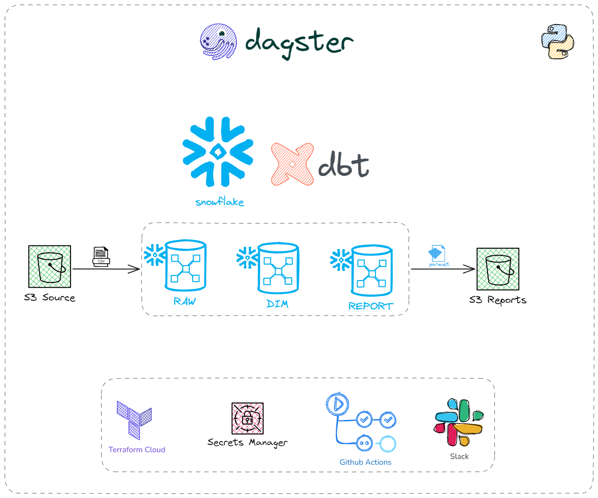
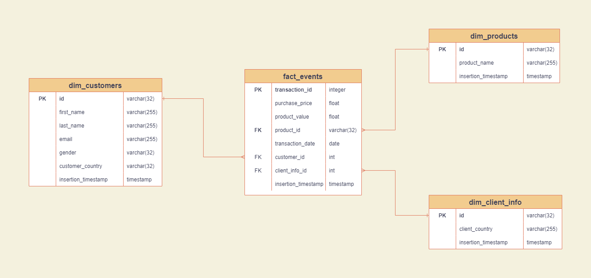

[](https://github.com/1byte-yoda/ae-tech-assessment)
[![codecov][code-cov-shield]][code-cov-url]
[](https://github.com/PyCQA/flake8)
[](https://github.com/psf/black)

# Problem Statement
You just started working for a company that sells products for a couple of countries in the world.

The Data Engineering team set up a process where you will receive a file into an s3 bucket on a daily basis. (An example of the last one is available under the ```data/``` folder).

On AWS S3, the file will be under the following folder:

```data/platform_transactions.csv```

After transformation, the files will be loaded into the S3 buckets `reports` folder.

This repository should contain a framework to:

- Grab the data from an s3 bucket
- Clean/transform the data
- Ingest into a Data Lake
- Create 2 reports
  - Total value of transactions and send to the Finance Team (```reports/``` folder inside the AWS S3 bucket)
  - Total number of transactions and sent to the Marketing Team (```reports/``` folder inside the AWS S3 bucket)

Details:

- Our Data Lake details are set up in the config folder (There are 3 environments, dev, stage and prod, but only prod is on the script)
- The Data Lake only contains 1 database, 1 schema, and 1 table inside it. All are defined inside the config folder too.
- At the moment, only 2 reports are created, one for the Finance Team and another one for the Marketing Team

You arrive on your first day at the job and see this repository. In the current state, the scripts work, it can manage all tasks required.
But there are new clients and products that will be added to the company soon, and more teams will request new reports, what would you do?

Would you change the current state of the repository or not? If you decide to do some changes, fork this repo and share with us!

----
**IMPORTANT**: <br>
Before doing anything else, in `config.py`, rename the `folder_alias` variable to your `LASTNAME_initials` (ex. `DELACRUZ_J`, `SMITH_S`)

# Solution


## Data Model



<hr>

# Prerequisites
### Cloning the Project Repository
```commandline
git clone https://github.com/1byte-yoda/ae-tech-assessment.git
```

### Installing Python and the Required Modules for this project
1. Go to https://www.python.org/downloads/ and install **Python 3.11**
2. Run the following command to install the modules in `requirements.txt`
```commandline
pip install virtualenv
virtualenv venv
venv/bin/activate  # For windows it is venv/Scripts/activate
pip install -r requirements.txt
```
3. Additional requirements for Development Purposes can be installed too
```text
pip install black==24.10.0 \
    flake8==7.1.1 \
    sqlfluff==3.2.4 \
    sqlfluff-templater-dbt==3.2.4 \
    pytest==8.3.3 \
    pytest-cov==5.0.0
```
4. Install **DBT Dependencies**
```commandline
cd dbt/ae_exam
dbt deps
```
4. Install **TFLint** by following the instructions [here](https://github.com/terraform-linters/tflint?tab=readme-ov-file#installation)
```commandline
tflint --version
```
5. Install **TFSec** by following the instructions [here](https://github.com/aquasecurity/tfsec?tab=readme-ov-file#installation)
```commandline
tfsec --version
```

### AWS
1. Go to IAM and Create a User
2. Create an access key by following [this guide](https://developer.hashicorp.com/terraform/cloud-docs/users-teams-organizations/users#creating-a-token)
3. By now you should have the **Access key** and **Secret access key**. Save these 2 information for later reference.

### Snowflake
1. Create a free trial snowflake account or sign in to your existing ones.
2. Create the snowflake user. In your snowflake account run the following queries. Note: Change the password in the code.
```sql
-- Use an admin role
USE ROLE ACCOUNTADMIN;

-- Create the `transform_dev` role
CREATE ROLE IF NOT EXISTS TRANSFORM_DEV;
GRANT ROLE TRANSFORM TO ROLE ACCOUNTADMIN;

-- Create the default warehouse if necessary
CREATE WAREHOUSE IF NOT EXISTS COMPUTE_WH;
GRANT OPERATE ON WAREHOUSE COMPUTE_WH TO ROLE TRANSFORM_DEV;
              
-- Create our database and schemas
CREATE DATABASE IF NOT EXISTS PLATFORM_DEV;
CREATE SCHEMA IF NOT EXISTS PLATFORM_DEV.RAW;
              
-- Create the `dbt` user and assign to role
CREATE USER IF NOT EXISTS etl
  PASSWORD='<YOUR_PASSWORD>'
  LOGIN_NAME='etl'
  MUST_CHANGE_PASSWORD=FALSE
  DEFAULT_WAREHOUSE='COMPUTE_WH'
  DEFAULT_ROLE=TRANSFORM_DEV
  DEFAULT_NAMESPACE='PLATFORM_DEV.RAW'
  COMMENT='ETL user used for data transformation';
GRANT ROLE TRANSFORM_DEV to USER etl;

-- Set up permissions to role `transform`
GRANT ALL ON WAREHOUSE COMPUTE_WH TO ROLE TRANSFORM_DEV; 
GRANT ALL ON DATABASE PLATFORM_DEV to ROLE TRANSFORM_DEV;
GRANT ALL ON ALL SCHEMAS IN DATABASE PLATFORM_DEV to ROLE TRANSFORM_DEV;
GRANT ALL ON FUTURE SCHEMAS IN DATABASE PLATFORM_DEV to ROLE TRANSFORM_DEV;
GRANT ALL ON ALL TABLES IN SCHEMA PLATFORM_DEV.RAW to ROLE TRANSFORM_DEV;
GRANT ALL ON FUTURE TABLES IN SCHEMA PLATFORM_DEV.RAW to ROLE TRANSFORM_DEV;
```
3. Save the 3 important bits Account Identifier *(https://<account_identifier>.snowflakecomputing.com)*, Username and Password

### Terraform
1. Install Terraform from [this website](https://developer.hashicorp.com/terraform/tutorials/aws-get-started/install-cli)
2. Make sure it was installed properly
```commandline
terraform --version
```
3. Register for a Terraform Cloud Account using [this website](https://app.terraform.io/public/signup/account)
4. Sign in and create a Terraform User Token [Here](https://app.terraform.io/app/settings/tokens). Don't forget to **Save the Token** into a secured place for our reference later.
5. Create the following TF Cloud Workspaces
    - data-junkie-corp-dev
    - data-junkie-corp-stage
    - data-junkie-corp-prod
6. Create the following Workspace Variables for each of the workspaces
```text
# FOR data-junkie-corp-dev
env = dev
AWS_ACCESS_KEY_ID = <YOUR_AWS_ACCESS_KEY_ID>
AWS_SECRET_ACCESS_KEY = <YOUR_AWS_SECRET_ACCESS_KEY>
snowflake_account = <YOUR_SNOWFLAKE_ACCOUNT_ID>
snowflake_password = <YOUR_SNOWFLAKE_PASSWORD>
snowflake_role = ACCOUNTADMIN
snowflake_username = <YOUR_SNOWFLAKE_USERNAME>

# FOR data-junkie-corp-stage
env = stage
AWS_ACCESS_KEY_ID = <YOUR_AWS_ACCESS_KEY_ID>
AWS_SECRET_ACCESS_KEY = <YOUR_AWS_SECRET_ACCESS_KEY>
snowflake_account = <YOUR_SNOWFLAKE_ACCOUNT_ID>
snowflake_password = <YOUR_SNOWFLAKE_PASSWORD>
snowflake_role = ACCOUNTADMIN
snowflake_username = <YOUR_SNOWFLAKE_USERNAME>

# FOR data-junkie-corp-prod
env = prod
AWS_ACCESS_KEY_ID = <YOUR_AWS_ACCESS_KEY_ID>
AWS_SECRET_ACCESS_KEY = <YOUR_AWS_SECRET_ACCESS_KEY>
snowflake_account = <YOUR_SNOWFLAKE_ACCOUNT_ID>
snowflake_password = <YOUR_SNOWFLAKE_PASSWORD>
snowflake_role = ACCOUNTADMIN
snowflake_username = <YOUR_SNOWFLAKE_USERNAME>
```

### Slack
1. Follow the steps in [this article](https://help.capenetworks.com/en/articles/2361824-creating-a-slack-api-token) so you can create a Slack Bot
2. After you install the app, you will find your user token starting with *xoxp-* on the OAuth & Permissions page. Save it for later use

### Setting Up the .env files
1. Copy the `env_examples/.env.dev.example` into a new file called `env_examples/.env.dev`
2. Fill In the Secret Values in the .env.dev file
```text
SLACK_DAGSTER_ETL_BOT_TOKEN=""
SNOWFLAKE_ACCOUNT=""
SNOWFLAKE_USER=""
SNOWFLAKE_PASSWORD=""
AWS_KEY_ID=""
AWS_SECRET_KEY=""
TERRAFORM_TOKEN=""
```
3. Repeat the steps 1 and 2 for `env_examples/.env.prod.example` and `env_examples/.env.stage.example`

### Configure The Secrets for Dagster
1. Run the `scripts/create_secrets.py`
```commandline
# Dev Environment Configuration
python scripts/create_secrets.py dev

# Stage Environment Configuration
python scripts/create_secrets.py stage

# Prod Environment Configuration
python scripts/create_secrets.py prod
```

## Local Development Commands
1. Running **Pytest Tests**
```commandline
cd dagster/data_analytics
ENV=stage DBT_SNOWFLAKE_ACCOUNT_STAGE=<YOUR_SNOWFLAKE_ACCOUNT_ID> DBT_SNOWFLAKE_PASSWORD_STAGE=<YOUR_SNOWFLAKE_PASSWORD> pytest -v -s
```
2. Running **Terraform Commands**
```commandline
cd terraform/dev

# Terraform Init
TF_TOKEN_app_terraform_io=<YOUR_TERRAFORM_TOKEN> terraform init

# Terraform Plan
TF_TOKEN_app_terraform_io=<YOUR_TERRAFORM_TOKEN> terraform plan

# Terraform Apply
TF_TOKEN_app_terraform_io=<YOUR_TERRAFORM_TOKEN> terraform apply

# Terraform Format
terraform fmt

# Terraform Validate
terraform validate

# Terraform Lint
tflint --init
tflint

# Terraform Security Scan
tfsec .
```
3. Running Python and SQL Linters and Formatter
```commandline
# Black Auto Format
black -l 150 dagster/data_analytics

# Flake8 Lint
flake8 dagster/data_analytics

# SQLFluff Lint
cd dbt/ae_exam
DBT_SNOWFLAKE_ACCOUNT_DEV=<YOUR_SNOWFLAKE_PASSWORD> DBT_SNOWFLAKE_PASSWORD_DEV=<YOUR_SNOWFLAKE_PASSWORD> sqlfluff lint .

# Beautify SQL
cd dbt/ae_exam
DBT_SNOWFLAKE_ACCOUNT_DEV=<YOUR_SNOWFLAKE_PASSWORD> DBT_SNOWFLAKE_PASSWORD_DEV=<YOUR_SNOWFLAKE_PASSWORD> sqlfluff fix .
```
4. Running **DBT Commands**
```commandline
cd dbt/ae_exam

# Debug DBT Connection
DBT_SNOWFLAKE_ACCOUNT_STAGE=<YOUR_SNOWFLAKE_ACCOUNT_ID> DBT_SNOWFLAKE_PASSWORD_STAGE=<YOUR_SNOWFLAKE_PASSWORD> dbt debug --target dev

# DBT Compile
DBT_SNOWFLAKE_ACCOUNT_STAGE=<YOUR_SNOWFLAKE_ACCOUNT_ID> DBT_SNOWFLAKE_PASSWORD_STAGE=<YOUR_SNOWFLAKE_PASSWORD> dbt compile --target dev

# DBT Build
DBT_SNOWFLAKE_ACCOUNT_STAGE=<YOUR_SNOWFLAKE_ACCOUNT_ID> DBT_SNOWFLAKE_PASSWORD_STAGE=<YOUR_SNOWFLAKE_PASSWORD> dbt build --target dev

# DBT Test
DBT_SNOWFLAKE_ACCOUNT_STAGE=<YOUR_SNOWFLAKE_ACCOUNT_ID> DBT_SNOWFLAKE_PASSWORD_STAGE=<YOUR_SNOWFLAKE_PASSWORD> dbt test --target dev
```

## Accessing Dagster UI
1. Run Dagster Webserver (Note: you must complete **Configure Secrets for AWS Secret Manager and Terraform** section)
```
cd dagster/data_analytics
dagster-webserver
```
2. Go to your browser and open http://127.0.0.1:3000/locations/data_analytics/jobs/indebted_ae_exam_job/
3. To run the job, upload the `data/data_platform_transactions.csv` file into `s3://ae-exam-bucket-dev/data/{DATE_TODAY}/`


[code-cov-shield]: https://codecov.io/gh/1byte-yoda/ae-tech-assessment/branch/master/graph/badge.svg?token=ZQ23COSI3V
[code-cov-url]: https://codecov.io/gh/1byte-yoda/ae-tech-assessment
